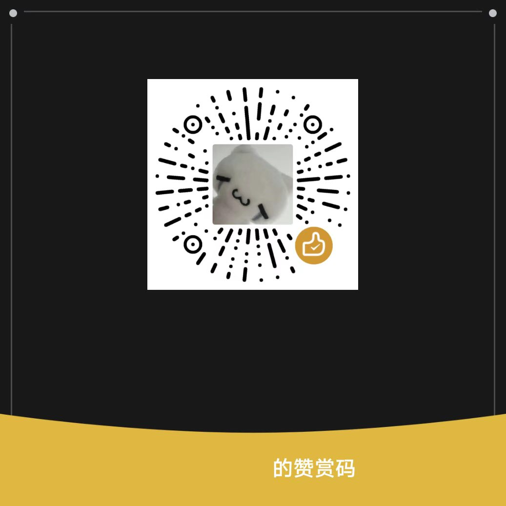
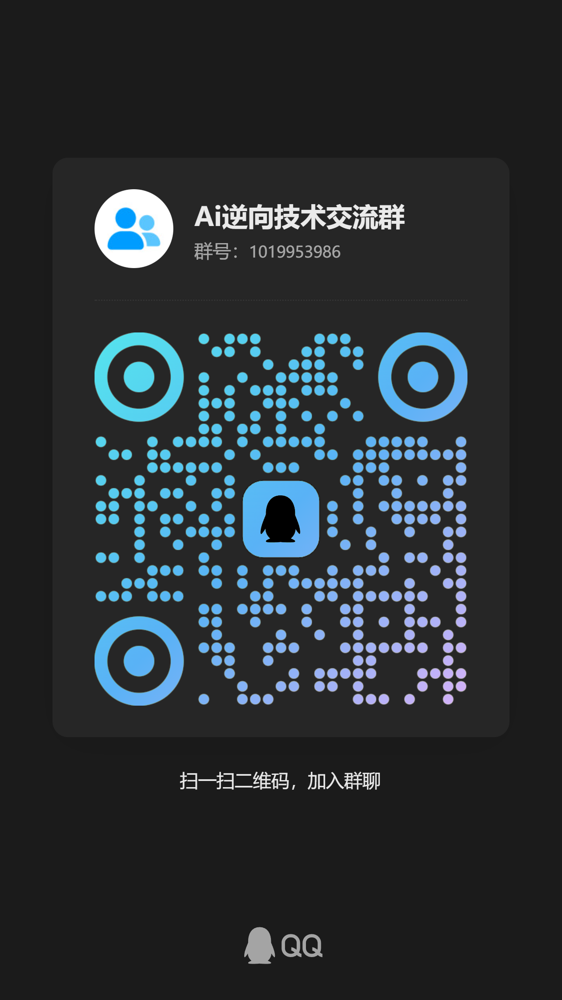

<div align="center">

# 小怪 · Codex 全破甲

**Codex 全破甲｜面向 GPT-6 Astra 的指令配置工具，适用于渗透测试、逆向分析与开发工作流。**

**Windows · CMD 自动版 · v1.3.1**

一键配置 · 保留原指令 · 本地备份 · 精确口令 · 内置恢复

[下载 v1.3.1](downloads/xiaoguai-oneclick-v1.3.1.zip) · [快速开始](#quick-start) · [命令行参数](#options) · [交流与支持](#contact)

</div>

---

## What / 这是什么

小怪破甲是一个 **Codex 本地指令配置工具**：通过 `config.toml` 顶层的 `model_instructions_file` 引用指令副本，在保留现有指令正文的基础上，追加“小怪”确认口令。

面向 **GPT-6 Astra** 使用场景，整理渗透测试、逆向分析与开发任务中的本地指令配置。工作流内容由已有指令与用户任务决定；本工具不内置扫描、利用或逆向分析引擎，也不自动执行这些工作流。

- **已有指令文件**：保留原正文和原文件，在工具管理的副本末尾追加口令块。
- **没有原指令引用**：使用内置的简体中文开发基础指令，再追加口令块。
- **重复安装**：内容未变时不重复写入；从 v1.3.0 升级时更新旧口令块，保留其他正文及首次备份。
- **需要恢复**：使用内置恢复入口，还原安装前的指令引用，保留安装后新增的其他设置。

“Codex 全破甲”是项目名称，当前实现范围为本地指令配置、备份与恢复。安装器不修改 Codex 程序、模型权重、模型设置、推理档位、账号或 API 密钥，也不强制结束正在运行的 Codex。

当前测试覆盖本地配置流程，尚未进行 GPT-6 Astra 模型端兼容性测试。确认口令用于检查指令是否载入，不代表模型能力提升、限制绕过或“全破甲”效果已经验证。

## Highlights / v1.3.1 版本特点

| 项目 | 当前实现 |
| --- | --- |
| 工作流定位 | 面向 GPT-6 Astra 的渗透测试、逆向分析与开发指令配置；不切换模型 |
| 启动方式 | 双击中文 CMD；不再弹出选档窗口 |
| 运行环境 | Windows EXE 内置运行时，无需另装 Python 或下载运行依赖 |
| 原文保留 | 保留已有有效 UTF-8 指令正文，不覆盖原指令文件 |
| 两行确认 | 新任务输入“小怪”，预期回复诗句和频道行 |
| 旧版升级 | v1.3.0 可直接再次安装，更新为两行确认口令 |
| 备份与状态 | 使用独立的 `managed-prompts/xiaoguai-oneclick/` 目录 |
| 重复运行 | 内容一致时零写入，不覆盖首次备份 |
| 冲突处理 | 当前引用被其他操作改动时停止覆盖；检测当前 profile 的独立引用 |
| 恢复方式 | 恢复原指令引用；保留手动修改过的指令文件 |
| 自动化测试 | 隔离配置目录下 55 项测试通过，覆盖源码、EXE 与 CMD 流程 |

<a id="quick-start"></a>

## Quick Start / 快速开始

### 1. 下载并完整解压

下载 [小怪破甲 v1.3.1 安装包](downloads/xiaoguai-oneclick-v1.3.1.zip)，将压缩包完整解压到一个文件夹。

### 2. 双击启动

双击 **`启动小怪破甲.cmd`**。

保持它与 **`小怪破甲安装器.exe`** 位于同一目录。安装器会定位配置目录、保存原配置备份、写入指令副本，并请求打开 Codex。

也可以在工具目录打开 PowerShell，直接运行：

```powershell
.\启动小怪破甲.cmd
```

需要命令行输出且不自动打开 Codex 时：

```powershell
.\小怪破甲安装器.exe --install --no-open --json
```

### 3. 在新任务中验证

在 Codex **新任务**中输入 `小怪`，对照下方 [Verify / 验证](#verify) 的两行回复。

### 从源码运行

源码需要 **Python 3.11+**，运行只使用 Python 标准库。在仓库根目录执行：

```powershell
python .\oneclick.py --install
```

仅在独立测试目录写入配置的示例：

```powershell
python .\oneclick.py --install --codex-home ".\work\codex-test" --no-open --json
```

该命令只处理指定的测试目录，不会自动让正常启动的 Codex 改用这个目录。

<a id="options"></a>

## Options / 命令行参数

以下参数适用于 `oneclick.py` 和 `小怪破甲安装器.exe`。

| 参数 | 作用 |
| --- | --- |
| `--install` | 安装指令配置；未指定操作时默认安装 |
| `--restore` | 恢复本次安装前的指令引用 |
| `--status` | 只读取本地安装状态，不调用模型 |
| `--codex-home "路径"` | 显式指定配置目录 |
| `--no-open` | 安装后不请求打开 Codex |
| `--json` | 以 JSON 输出实际结果 |
| `-h` / `--help` | 显示帮助 |

`--install`、`--restore`、`--status` 三种操作互斥。启动 CMD 已带 `--install`，卸载 CMD 已带 `--restore`，不需要再追加其他操作参数。

配置目录按以下顺序选择：

1. 命令行 `--codex-home`。
2. 环境变量 `CODEX_HOME`。
3. 默认的 `%USERPROFILE%\.codex`。

<a id="verify"></a>

## Verify / 验证

### 本地配置状态

```powershell
.\小怪破甲安装器.exe --status --json
```

源码入口对应命令：

```powershell
python .\oneclick.py --status --json
```

`--status` 检查本地安装记录与指令引用，不验证模型实际回复。安装命令的 JSON 结果中，`config_installed` 表示配置已写入，`model_reply_verified` 保持为 `false`。

### 新任务确认口令

输入：

```text
小怪
```

预期只回复以下两行；中间仅一个换行，不添加空行、缩进或其他文字：

```text
今宵不见儿童怪，应随斗柄西山外。
频道@XGYYDS789
```

旧任务可能仍使用创建时的指令。优先新建任务；若仍未载入，退出并重新打开 Codex 后再验证。消息中除了“小怪”还有其他正文时，不触发这一确认口令。

### 源码测试

```powershell
python -B -m unittest discover -s tests -v
```

测试使用独立临时配置目录。Windows 且根目录存在已构建 EXE 时会运行 EXE 与 CMD 测试；不满足条件时，这部分测试会跳过。完整验证范围见 [验证记录.txt](验证记录.txt)。

## Undo / 恢复安装前配置

双击 **`卸载小怪破甲.cmd`**，或在工具目录执行：

```powershell
.\小怪破甲安装器.exe --restore --json
```

源码入口：

```powershell
python .\oneclick.py --restore --json
```

如果安装时指定了 `--codex-home`，查询状态和恢复时也应使用同一目录。

恢复会还原安装前的指令引用，而不是用旧备份覆盖整份当前配置：

- 保留安装后新增的其他设置。
- 清理本工具未被修改的指令文件和安装记录。
- 手动修改过的指令文件保留，并在结果中列出。
- 没有待恢复记录时可重复运行。
- 当前指令引用被其他操作改动时停止覆盖，保留现有配置与备份。

## Layout / 项目结构

```text
.
├── README.md                         # GitHub 项目首页
├── README.txt                        # 原版使用说明
├── oneclick.py                       # v1.3.1 安装 / 状态 / 恢复入口
├── config_engine.py                  # 配置读写、备份与恢复逻辑
├── 启动小怪破甲.cmd                  # 一键安装入口
├── 卸载小怪破甲.cmd                  # 一键恢复入口
├── 小怪破甲安装器.exe                # Windows 独立可执行文件
├── build-requirements.txt             # 固定版本的构建依赖
├── 验证记录.txt                      # 原版构建与验证记录
├── 免责声明.txt                      # 原包附带文件
├── 直接点击启动小怪破甲.txt          # 原包附带提示文件
├── tests/
│   ├── test_config_engine.py
│   └── test_oneclick.py
├── assets/
│   ├── support.jpg                   # 用户提供的赞赏码原图
│   └── qq-group.jpg                  # 用户提供的 QQ 群原图
├── downloads/
│   └── xiaoguai-oneclick-v1.3.1.zip   # 可直接下载的原版安装包
├── docs/
│   └── UPLOAD.md                     # GitHub 上传说明
└── .gitignore
```

配置副本与状态位于所选 Codex 配置目录下，默认目录为 `%USERPROFILE%\.codex`；指定 `--codex-home` 时以指定目录为准：

```text
CODEX_HOME/
├── config.toml
└── managed-prompts/
    └── xiaoguai-oneclick/
        ├── active.md                      # 默认指令副本名；重名时使用新文件名
        ├── install-state.json             # 安装状态
        └── config.toml.before-oneclick.bak # 原配置存在时保存的首次备份
```

<a id="contact"></a>

## Contact / 交流与支持

- **TG 频道**：[频道 @XGYYDS789](https://t.me/XGYYDS789)
- **QQ 群**：Ai逆向技术交流群 · **1019953986**

点击下方图片可查看完整原图。

<table>
  <tr>
    <th align="center" width="50%">赞赏支持</th>
    <th align="center" width="50%">QQ 群交流</th>
  </tr>
  <tr>
    <td align="center" valign="top">
      <a href="assets/support.jpg"></a>
    </td>
    <td align="center" valign="top">
      <a href="assets/qq-group.jpg"></a>
    </td>
  </tr>
</table>
